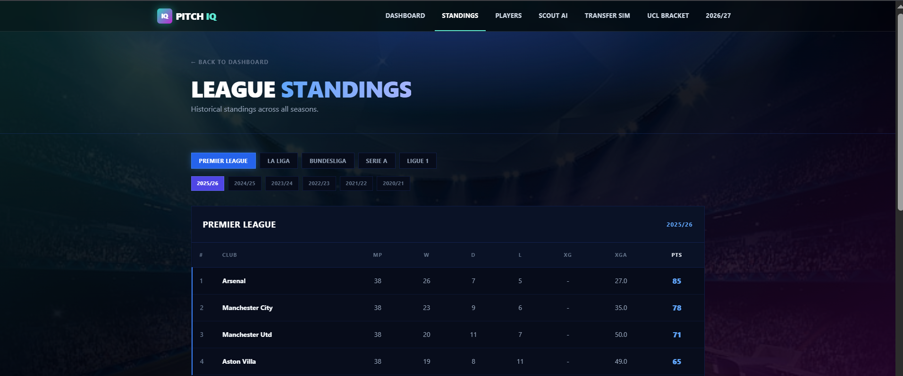
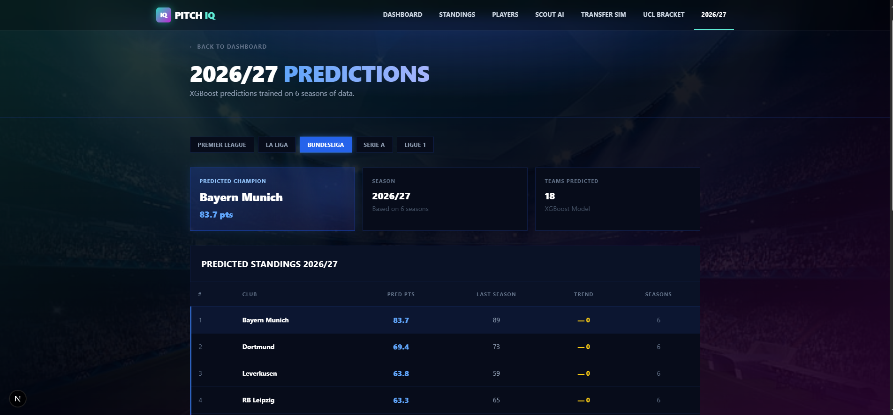
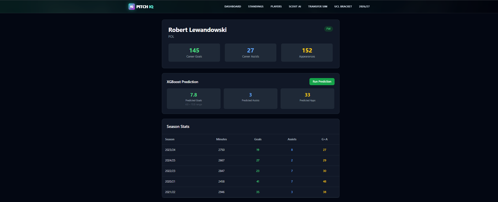
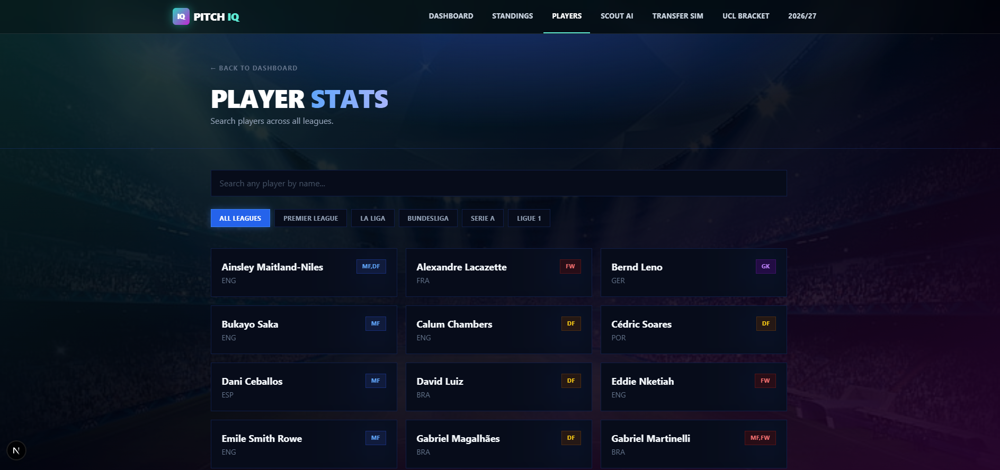
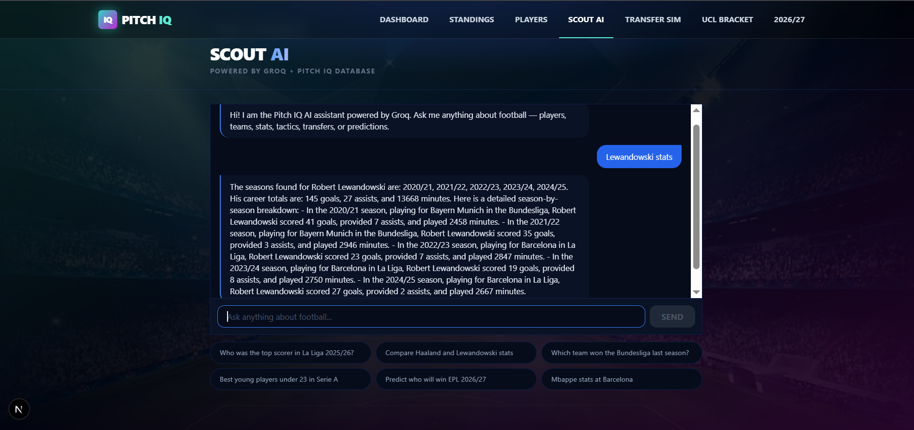
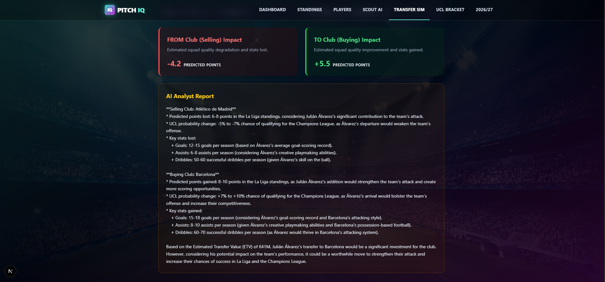
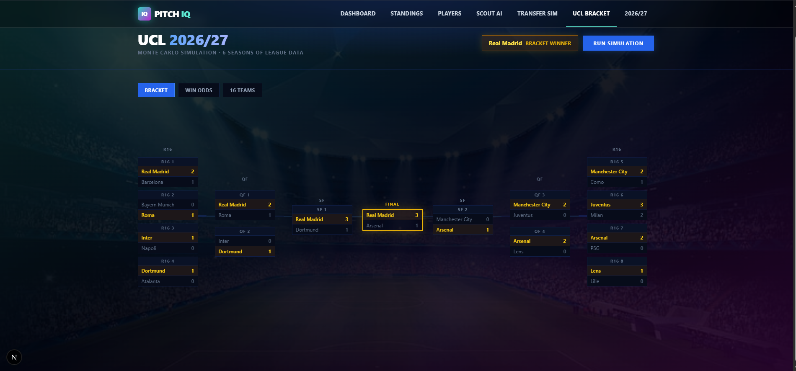
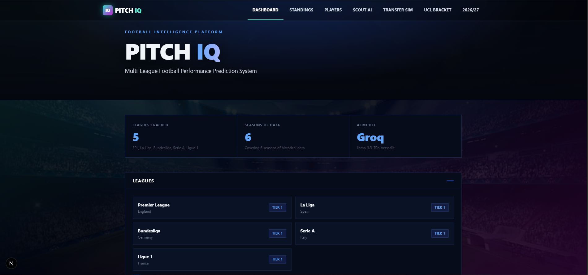

# Pitch IQ ⚽

A full-stack football analytics platform that predicts league standings, simulates UCL brackets, and provides AI-powered transfer analysis using 6 seasons of real data.

## Screenshots

### Dashboard


### League Standings & Predictions



### Players



### Scout AI


### Transfer Simulator


### UCL Bracket



### Home


## Features

- **League Predictions** — XGBoost model predicts next season standings for EPL, La Liga, Bundesliga, Serie A, Ligue 1 using 6 seasons of historical data
- **UCL Bracket Simulation** — Monte Carlo simulation (1000 iterations) predicts Champions League winners based on domestic performance
- **Scout AI** — Ask anything about any player or team. Powered by Groq (llama-3.3-70b) + Tavily real-time web search
- **Transfer Simulator** — Analyze hypothetical transfers with AI. Get points impact, UCL probability changes, and statistical reasoning for both clubs
- **5000+ Real Players** — Scraped from FBref across EPL, La Liga, Bundesliga, Serie A, Ligue 1 (2020-2026)
- **Player Profiles** — Career stats, season-by-season breakdown, goals, assists, minutes

## Tech Stack

### Backend
- **FastAPI** + **PostgreSQL** + **SQLAlchemy** + **Alembic**
- **XGBoost** + **scikit-learn** for predictions
- **Groq API** (llama-3.3-70b-versatile) for all AI agents
- **Tavily** for real-time web search
- **soccerdata** + FBref scraping for 6 seasons of stats
- Monte Carlo simulation for UCL bracket

### Frontend
- **Next.js 15** (App Router) + **Tailwind CSS**
- **Recharts** for data visualization
- **Framer Motion** for animations

## Project Structure
pitch-iq/
├── backend/
│   ├── app/
│   │   ├── agents/          # Groq AI agents
│   │   ├── api/             # FastAPI routes
│   │   ├── models/          # SQLAlchemy models
│   │   ├── schemas/         # Pydantic schemas
│   │   ├── services/        # Prediction engine
│   │   └── utils/           # Rate limiter, helpers
│   ├── alembic/             # DB migrations
│   └── requirements.txt
└── frontend/
└── src/
├── app/             # Next.js pages
├── components/      # UI components
└── lib/             # API client

## Setup

### Backend
```bash
cd backend
python -m venv venv
venv\\Scripts\\activate
pip install -r requirements.txt
cp .env.example .env
# Add your API keys to .env
uvicorn app.main:app --reload
```

### Frontend
```bash
cd frontend
npm install --legacy-peer-deps
npm run dev
```

### Environment Variables
```env
DATABASE_URL=sqlite:///./pitchiq.db
GROQ_API_KEY=your_groq_api_key
TAVILY_API_KEY=your_tavily_api_key
NEWS_API_KEY=your_news_api_key
SECRET_KEY=your_secret_key
```

## Data Pipeline

Player and team data is scraped from FBref using soccerdata:
```bash
cd backend
python scrape_league.py epl
python scrape_league.py laliga
python scrape_league.py bundesliga
python scrape_league.py seriea
python scrape_league.py ligue1
```

## Author

**Hassan** — Data Science Student, Institute of Space Technology (IST), Islamabad

## License

MIT
